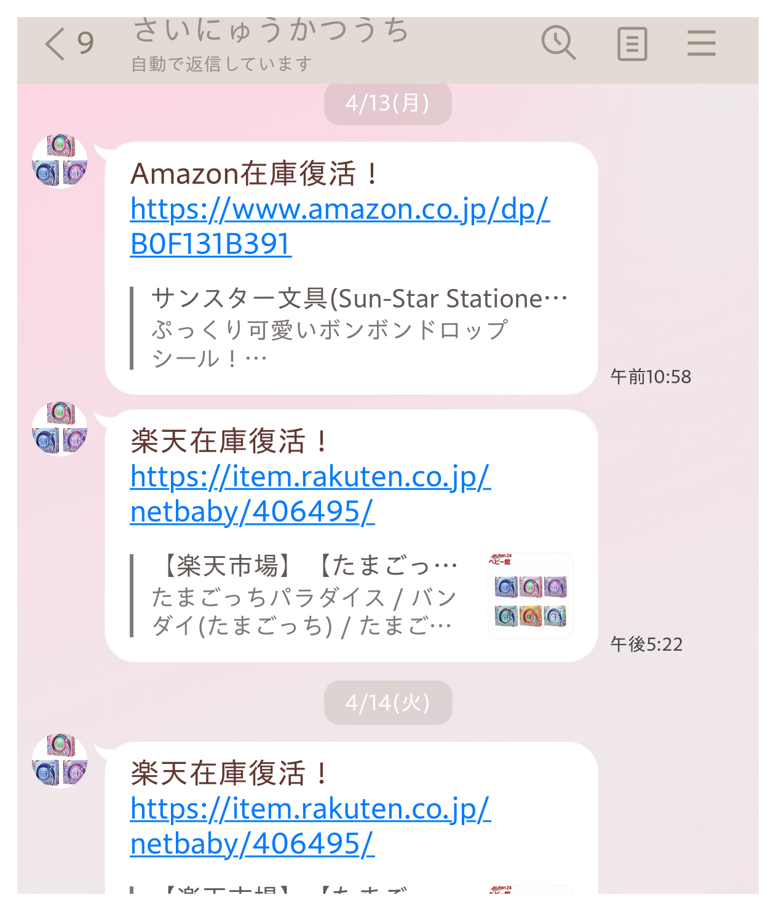

# 楽天・Amazon 在庫監視Bot

楽天市場とAmazonの商品在庫を定期的に監視し、在庫復活を検知した際にLINEへ通知する個人開発Botです。

## 概要

欲しい商品の在庫状況を定期的に確認する手間をなくし、在庫が復活したタイミングを把握するために開発しました。

## 主な機能

- 楽天市場の商品在庫監視
- Amazonの商品在庫監視
- Amazonでは販売元が「Amazon.co.jp」の商品のみを対象
- 在庫復活時のLINE通知
- 同一商品の重複通知防止
- 在庫切れ後の再入荷時には再通知
- 複数のAmazon商品を同時監視

## 📷 動作画面

### LINE通知

在庫復活を検知すると、LINEへ商品URLを通知します。



## 使用技術

- Python
- requests
- BeautifulSoup
- LINE Messaging API
- HTML / schema.org の情報を利用した在庫判定

## 在庫判定

### 楽天市場

商品ページのHTMLに含まれるschema.orgの情報を利用して、`InStock`、`LimitedAvailability`、`PreOrder` を購入可能として判定します。

### Amazon

商品ページに「カートに入れる」または「今すぐ買う」が存在することを確認し、さらに販売元が `Amazon.co.jp` である場合に在庫ありと判定します。

## 重複通知防止

一度通知した商品を記録し、在庫が継続している間は同じ商品の通知を繰り返さないようにしています。

在庫がなくなると記録を解除し、再び在庫が復活した際には再度通知します。

## 監視間隔

商品ページへのアクセス間隔は12～15秒のランダムな時間に設定しています。

## 設定

LINEのトークンやユーザーIDなどの秘密情報は、ソースコードに直接記述せず環境変数から読み込みます。

例:

```text
LINE_TOKEN=your_token
USER_ID=your_user_id
```

実際のトークンはGitHubへ公開しないでください。
